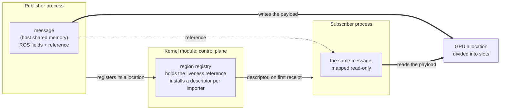

# GPU IPC Design

A GPU payload remains in the allocation that the GPU already reads and writes, with no process ever
copying it. What crosses process boundaries is merely a short reference to that allocation,
transmitted within standard host shared-memory messages alongside ROS fields.

This reference is deliberately not a pointer. A device address is valid only within the process that
mapped the allocation, so each process resolves the reference into its own local address space.

The underlying physical memory location—whether device memory on a discrete GPU or shared DRAM on an
SoC—is irrelevant to the design. What matters is that every process can map the same allocation,
ensuring nothing is moved or duplicated during sharing.

This document records the architectural decisions shaping the feature as a whole. Localized
implementation decisions belong alongside their respective code.

## A message identifies its memory location using a region and a slot

An allocation is divided into equal-sized slots. Borrowing a message reserves a slot and records two
identifiers within the message: the region to which the slot belongs, and the slot's index within
that region. Upon receiving its first message from a given publisher, a subscriber reads these
values and maps the corresponding region. From then on, it resolves every subsequent message into
its own local address space independently.

Region IDs remain unique throughout the kernel module's lifetime and are never reused. Consequently,
a message referencing a defunct region resolves to nothing rather than mapping to an unrelated
allocation. Because these two identifiers originate from another process, they are strictly
bounds-checked before being converted into an address.

## The kernel module holds the region's lifetime

The module operates strictly within the control plane: it never reads or writes device memory. It
handles two critical tasks that userspace cannot perform for itself:

First, it holds a liveness reference to the allocation, ensuring the memory outlives the process that
created it. Even if a publisher crashes, a subscriber reading its message is accessing memory that
remains validly allocated.

Second, it installs a descriptor for each importer, eliminating the need to pass descriptors between
processes over side channels.

## Why CUDA IPC is Excluded

CUDA IPC (`cudaIpcGetMemHandle`) seems like the obvious candidate for sharing device memory between
processes, but it is deliberately omitted. The rationale is as follows:

- **The Requirement:** A subscriber may still be reading a payload when the publisher that created
  it dies—which is precisely why the module maintains a liveness reference. A mechanism qualifies
  only if the memory allocation can outlive its creating process.
- **Why Chosen Mechanisms Qualify:** For both CUDA VMM and NvSciBuf, allocations are backed by
  objects that a third party can hold on the creator's behalf (a file descriptor for CUDA VMM, and
  native reference counting for NvSciBuf). The module holds onto these, allowing memory to survive
  process exit.
- **Why CUDA IPC Fails:** A CUDA IPC handle is merely an opaque token rather than a handle to a
  reference-counted kernel object. There is nothing for the module—or any other process—to hold. The
  allocation remains strictly owned by the exporting process and is freed upon its exit, leaving
  importers with dangling device pointers.
- **What Support Would Require:** Restoring lifetime guarantees would require moving allocation
  ownership out of the publisher. A separate, long-lived central daemon would need to execute every
  `cudaMalloc` and distribute handles, ensuring the owner never exits while a payload is active.
- **Why It Isn't Worth It:** Such a daemon introduces a new component to deploy, supervise, and
  version-match, as well as a single point of failure for all GPU topics. Furthermore, it would
  exist solely for CUDA IPC, whereas other mechanisms require no such daemon because their
  underlying kernel objects handle lifetime natively. Finally, CUDA IPC is a legacy interface being
  actively superseded by the CUDA VMM API for this exact reason.

## Access follows the subscription

A GPU payload is reachable only through the kernel module, which hands a descriptor to a caller
holding a registered subscription to that topic in the calling process. There is no named object a
bystander can open.

This is stricter than the host data plane, where a publisher's shared memory is a named object that
any process on the machine may map read-only. It is not a policy difference so much as a consequence
of the mechanism—a descriptor has to be installed by someone—but it is worth knowing which of the two
planes is the weaker one when reasoning about confidentiality.

It remains a boundary rather than a sandbox. The module cannot establish that a descriptor handed to
it is GPU memory at all, so it does not try; and the read-only access an importer receives is the
importing library's doing rather than something the kernel imposes.

## Growing rather than failing is the first response

Sizing an allocation is a guess about a payload size the publisher may not know in advance. Rather
than fail a borrow that does not fit, a publisher allocates an additional region, and the message
records which one its payload went into. Additional regions require no coordination between
processes, precisely because a subscriber maps an unseen region on first receipt.

Growth is bounded, so it is a first response rather than a guarantee: a borrow still fails when the
publisher already holds as many regions as it may and none of them can be given up. Regions are
reclaimed where the knowledge to do so exists—only the publisher can tell that a region holds no
message, since the module never sees which region a message was written into.

## Reclaiming Regions from Departed Publishers

Caching a mapping is what makes processing every frame after the first zero-overhead. However,
retaining mappings indefinitely causes a subscriber to accumulate mappings—and, because an imported
handle holds its own driver reference, unfreeable device memory—for every region of every publisher
it ever encounters. If a publisher is repeatedly restarted by a supervisor, this resource footprint
would grow without bound.

To prevent this, an imported region is released once two conditions are met:

1. No active references to the region remain within the local subscriber process.
2. The kernel module no longer recognizes the publisher that exported it.

The second condition makes the release completely safe: because region IDs are never reused, a
publisher that the module has forgotten can never reference that region again. The first condition
must be tracked internally by the subscriber process itself, as the module's accounting of in-flight
messages is not a reliable indicator of what the local process is still actively holding.

## GPU work stays out of the shared-memory window

Everything allocated between borrowing a message and publishing it comes from the process's
shared-memory mempool—that is how a message's payload gets there. The GPU driver allocates host
memory of its own on paths the library must call from inside that interval, and left alone, that
bookkeeping would become a permanent resident of the segment every subscriber maps.

The library therefore suspends the window around its own work and the driver's, and restores it
around the caller's. The division is what makes this safe: only the caller's code can allocate
something that belongs to the message, and only the message's allocations belong in the segment.
