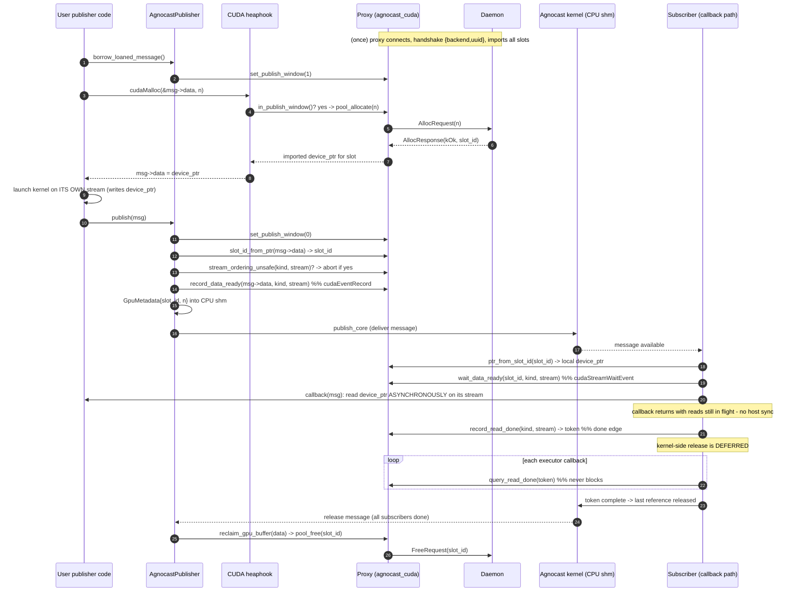
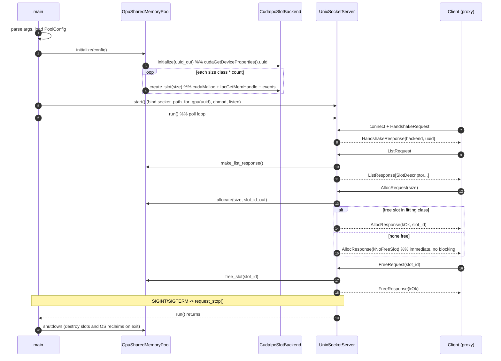
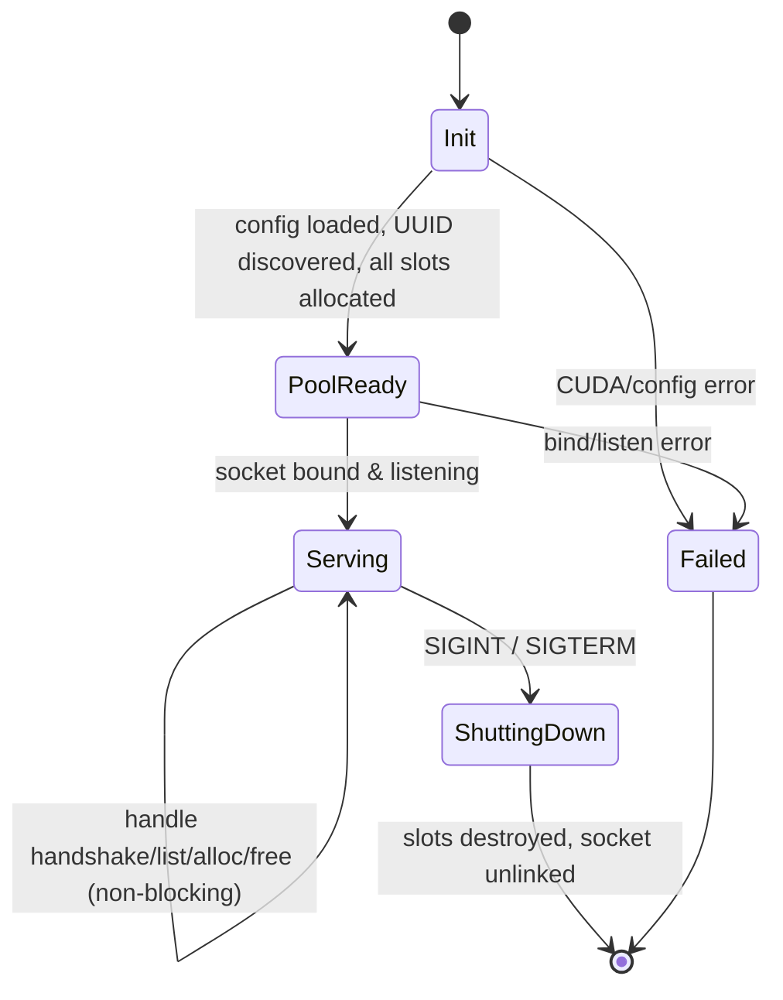

# Agnocast GPU-IPC (CUDA) Design Document

## 1. Purpose

Agnocast provides true zero-copy publish/subscribe for ROS 2 by placing message
payloads in shared memory, so subscribers read the exact bytes the publisher
wrote without any copy. That mechanism covers **host (CPU) memory** only.

GPU-accelerated Autoware nodes (camera, LiDAR, perception) keep large buffers in
**CUDA device memory**. Passing such a message between two processes on the same
GPU normally means **device→host→device** copies or per-message CUDA IPC export,
both of which cost latency and bandwidth on every message.

The GPU-IPC feature extends Agnocast so that a CUDA message's **device buffer**
is also shared zero-copy: the publisher and all subscribers on the same physical
GPU operate on the *same* device allocation, with GPU-side ordering guaranteeing
the subscriber reads only after the publisher's write completes.

The design goal is that a CUDA publisher writes ordinary code
(`cudaMalloc(&msg->data, n)`, launch a kernel, `publish()`), and the framework
transparently routes that allocation into a shared GPU pool.

---

## 2. Relationship to the existing CPU Agnocast

### 2.1 Similarities

| Aspect | CPU Agnocast | GPU-IPC extension |
|---|---|---|
| Zero-copy transport | shared host memory (`/dev/agnocast` + mmap) | shared **device** memory (CUDA IPC) |
| Allocation interception | `libagnocast_heaphook.so` hooks `malloc`/`free` | `libagnocast_cuda_heaphook.so` hooks the CUDA runtime and driver allocators |
| Message lifetime | kernel refcount; freed when all subscribers release | **same** refcount; GPU slot reclaimed on last release |
| API surface | `borrow_loaned_message()` / `publish()` / callback | unchanged — same calls |
| Discovery / delivery | Agnocast kernel module | **reused as-is**; GPU adds only a `slot_id` in the payload |

The CPU path is unchanged and remains the transport for the message struct
itself (headers, and the small `GpuMetadata`). The GPU buffer is shared by an
additional, separate mechanism layered on top.

### 2.2 Differences

- The CPU heaphook can place *any* allocation in shared memory. The GPU buffer,
  by contrast, is served from a **fixed pre-allocated pool** owned by a
  **daemon**, not allocated ad hoc. GPU IPC handle export is expensive and must
  be amortized, and device memory must be bounded.
- A **daemon process** (`gpu_shared_memory_daemon`) must be running; it owns the
  pooled device memory and exports it. CPU Agnocast has no equivalent per-GPU
  daemon.
- The GPU buffer needs **GPU-side ordering**, which has no analogue in the CPU path:
  an interprocess CUDA event for the write→read edge, and a deferred, polled release
  for the read→reuse edge (§7).

### 2.3 Restrictions (current)

1. **Same physical GPU.** All participants must be on the GPU the daemon manages
   (matched by UUID). Cross-GPU sharing is refused at handshake.
2. **Pooled sizes only.** An allocation inside the publish window is served from
   the smallest size class that fits. If the pool cannot satisfy it, the hook
   **falls back to a real allocation** — publishing still works but that
   message is *not* zero-copy (and `publish()` aborts if the buffer is not
   pooled, so effectively the pool must be sized for the workload).
3. **Streams are declared, never inferred.** A publisher or subscription whose GPU
   work runs on its own stream must declare it
   (`PublisherOptions::cuda_stream` / `SubscriptionOptions::cuda_stream`, or the
   per-call `publish(msg, stream)`). Declaring nothing is supported and correct — the
   legacy default stream is used — but it costs a GPU-side barrier against every
   blocking stream, and it is a **hard error** (abort with a message naming the fix)
   if the process also created a `cudaStreamNonBlocking` stream. See §7.
4. **One event captures one stream.** A publisher that produces a single message from
   several streams must join them before `publish()`.
5. **`CudaStream::per_thread_default()` is thread-affine.** It is the one stream kind
   that is not thread-independent, so a subscription using it still requires the take,
   the callback, and the drop of the last message reference to happen on one thread
   (single-threaded / callback-isolated executors). Explicit streams — the recommended
   form — carry no such requirement; see decision 21.
6. **Publish window only.** Only allocations between `borrow_loaned_message()` and
   `publish()` **on the same thread** are pooled.
7. **`cuMemCreate` buffers cannot be pooled.** The virtual-memory-management API
   returns an allocation *handle* that the caller maps itself, so a message buffer must
   come from `cudaMalloc` / `cudaMallocAsync` / `cuMemAlloc` / `cuMemAllocAsync`.

---

## 3. Component / class model

Three build units plus the agnocastlib glue:

- `agnocast_gpu_shared_memory_daemon` — the daemon (owns pooled GPU memory).
- `agnocast_cuda` — the client-side proxy + C ABI (loaded into pub/sub processes).
- `agnocast_cuda_heaphook` — Rust `cdylib`, `LD_PRELOAD`ed, hooks the CUDA runtime and
  driver allocators and detects non-blocking stream creation.
- `agnocastlib` — CUDA-free core; calls the C ABI, carries `GpuMetadata`.

```mermaid
classDiagram
    direction LR

    %% ---------------- Daemon side ----------------
    class GpuSharedMemoryPool {
        +initialize(PoolConfig) bool
        +allocate(size) Status,slot_id   %% non-blocking
        +free_slot(slot_id)
        +list() SlotDescriptor[]
        +gpu_uuid() string
        +shutdown()
    }
    class GpuSlotBackend {
        <<interface>>
        +initialize(uuid_out) bool
        +create_slot(size, out) bool
        +destroy_slot(resources)
    }
    class CudaIpcSlotBackend {
        +initialize()  %% cudaGetDeviceProperties().uuid
        +create_slot() %% cudaMalloc + cudaIpcGetMemHandle + events
    }
    class UnixSocketServer {
        +start() bool
        +run()             %% poll loop, never blocks on a client
        +request_stop()
    }
    class RequestHandler {
        +handle(MessageType, payload) response
    }
    class PoolConfig
    class Protocol {
        <<header>>
        +socket_path_for_gpu(uuid)
        +serialize/deserialize
    }

    GpuSharedMemoryPool o--> GpuSlotBackend : delegates
    CudaIpcSlotBackend ..|> GpuSlotBackend
    GpuSharedMemoryPool <.. PoolConfig
    UnixSocketServer o--> RequestHandler
    RequestHandler o--> GpuSharedMemoryPool
    UnixSocketServer ..> Protocol
    RequestHandler ..> Protocol

    %% ---------------- Client side ----------------
    class GpuSharedMemoryPoolProxy {
        <<singleton>>
        +allocateMemory(out, size) bool  %% retries on kNoFreeSlot
        +freeMemory(ptr)
        +getSlotIdFromDevicePtr(ptr) id
        +getDevicePtrFromSlotId(id) ptr
        +recordDataReady(ptr, kind, stream) bool
        +waitDataReady(slot_id, kind, stream) bool
        +recordReadDone(kind, stream, out_token) bool   %% done edge
        +queryReadDone(token) int                       %% never blocks
        +waitReadDone(token)
        +isDefaultStream(kind, stream) bool
    }
    class GpuClientBackend {
        <<interface>>
        +import_slot(desc, out) bool
        +release_slot(imported)
        +local_gpu_uuid(out) bool
        +record_data_ready(imported, kind, stream) bool
        +wait_data_ready(imported, kind, stream) bool
        +create_read_done_marker(out) bool
        +destroy_read_done_marker(marker)
        +record_read_done_marker(marker, kind, stream) bool
        +query_read_done_marker(marker) int
        +sync_read_done_marker(marker)
        +is_default_stream(kind, stream) bool
    }
    class CudaIpcClientBackend {
        %% cudaIpcOpenMemHandle / OpenEventHandle
        %% ready edge: cudaEventRecord / cudaStreamWaitEvent on the declared stream
        %% done edge: plain cudaEvent_t + cudaEventQuery (pooled, non-interprocess)
    }
    class ProxyCApi {
        <<extern C>>
        +agnocast_cuda_set_publish_window(int)
        +agnocast_cuda_pool_allocate(size, out)
        +agnocast_cuda_pool_free(ptr)
        +agnocast_cuda_slot_id_from_ptr(ptr, out)
        +agnocast_cuda_ptr_from_slot_id(id, out)
        +agnocast_cuda_record_data_ready(ptr, kind, stream)
        +agnocast_cuda_wait_data_ready(id, kind, stream)
        +agnocast_cuda_record_read_done(kind, stream, out)
        +agnocast_cuda_query_read_done(token)
        +agnocast_cuda_wait_read_done(token)
        +agnocast_cuda_note_non_blocking_stream()
        +agnocast_cuda_stream_ordering_unsafe(kind, stream)
        +agnocast_cuda_reclaim_gpu_buffer(ptr)
    }

    GpuSharedMemoryPoolProxy o--> GpuClientBackend : delegates
    CudaIpcClientBackend ..|> GpuClientBackend
    ProxyCApi ..> GpuSharedMemoryPoolProxy
    GpuSharedMemoryPoolProxy ..> Protocol : UDS client

    %% ---------------- Heaphook + agnocastlib ----------------
    class CudaHeaphook {
        <<LD_PRELOAD cdylib>>
        +cudaMalloc/cudaMallocAsync  %% -> pool in publish window
        +cudaFree/cudaFreeAsync      %% -> pool if pooled
        +cuMemAlloc(_v2)/cuMemAllocAsync
        +cuMemFree(_v2)/cuMemFreeAsync
        +cuMemCreate                 %% pass-through, warns in window
        +cudaStreamCreateWithFlags   %% detects cudaStreamNonBlocking
        +cuStreamCreate(WithPriority)
    }
    class AgnocastPublisher {
        +borrow_loaned_message()
        +publish(msg)
        +publish(msg, stream)
    }
    class AgnocastSubscription {
        +create_subscriber_ipc_ptr(.., stream)
    }
    class GpuMetadata {
        +uint32 slot_id
        +size_t gpu_data_size
    }
    class CudaStream {
        <<CUDA-free>>
        +CudaStreamKind kind
        +void* handle
    }
    class DeferredRelease {
        <<CUDA-free, agnocastlib>>
        +defer_subscriber_release(..)
        +drain_deferred_subscriber_releases()
        +flush_deferred_subscriber_releases()
    }

    CudaHeaphook ..> ProxyCApi : RTLD_DEFAULT
    AgnocastPublisher ..> ProxyCApi : link-resolved
    AgnocastSubscription ..> ProxyCApi : link-resolved
    AgnocastPublisher ..> GpuMetadata
    AgnocastSubscription ..> GpuMetadata
    AgnocastPublisher ..> CudaStream
    AgnocastSubscription ..> CudaStream
    AgnocastSubscription ..> DeferredRelease
    DeferredRelease ..> ProxyCApi : function pointers installed by the CUDA path
```



### 3.1 Responsibilities

**Daemon (`agnocast_gpu_shared_memory_daemon`)**

- `protocol.hpp` — wire format (little-endian, explicit serialization),
  message types (handshake / list / alloc / free), `Status`, `BackendType`,
  variable-length length-prefixed handle blobs (fit CUDA's 64 B and larger NvSci
  handles), and `socket_path_for_gpu(uuid)` (socket path derived from the GPU
  UUID under `/run/agnocast`). Bounds-checked deserializers.
- `socket_io.hpp` — framed message read/write over the Unix socket; shared by
  server and proxy.
- `PoolConfig` / `pool_config_loader` — pool *geometry only* (size classes:
  `slot_size_bytes` × `slot_count`).
- `GpuSlotBackend` (interface) / `CudaIpcSlotBackend` — GPU-specific slot
  creation: `cudaMalloc` the slot, `cudaIpcGetMemHandle`, create the per-slot
  interprocess events and `cudaIpcGetEventHandle`, discover the UUID via
  `cudaGetDeviceProperties().uuid`.
- `GpuSharedMemoryPool` — owns all slots grouped by size class; **non-blocking**
  best-fit `allocate()` (returns `kOk`/`kNoFreeSlot`/`kSizeTooLarge`
  immediately), `free_slot`, `list`, `shutdown`. Delegates GPU work to the backend.
- `RequestHandler` — translates a protocol request into a pool operation and
  builds the response, including the handshake `{backend_type, gpu_uuid}`.
- `UnixSocketServer` — listens, accepts, runs a `poll()` loop, and dispatches.
  **Never blocks on client behaviour.**
- `main.cpp` — args (`--config`, `--socket-path`), load config, init pool, derive
  socket, install SIGINT/SIGTERM handlers, run.

**Client (`agnocast_cuda`)**

- `cudart_loader.hpp` — lazy `dlopen` of `libcudart.so` (no build-time CUDA
  dependency; the package builds on a CUDA-less build farm).
- `GpuClientBackend` / `CudaIpcClientBackend` — import a slot
  (`cudaIpcOpenMemHandle` + `cudaIpcOpenEventHandle`), release it, report the
  local UUID, record/wait the data-ready event **on the declared stream** (the ready
  edge), and provide the read-done markers the done edge polls (plain, process-private
  `cudaEvent_t`s created with `cudaEventDisableTiming`, driven by `cudaEventRecord` /
  `cudaEventQuery` / `cudaEventSynchronize`). Also answers whether a
  `(stream_kind, stream)` pair resolves to a *default* stream, which is what the
  fail-fast check in §7 needs.
- `GpuSharedMemoryPoolProxy` — process-wide singleton. On first use it connects
  to the daemon (socket derived from the local UUID), performs the handshake
  (verifying backend type and UUID), and **imports every slot**. Serves
  `allocateMemory` (retries on `kNoFreeSlot` without holding locks),
  `freeMemory`, ptr↔slot_id lookups, and record/wait. Reconnects and re-imports
  on I/O error. Also owns a **free list of read-done markers**, so a steady-state
  reader creates only as many as it has messages in flight. A marker whose query *fails*
  is reported as complete (so it cannot pin a slot forever) but destroyed rather than
  recycled — recycling it would, under a sticky context error, make every later message
  report "complete" on its first poll and silently disable the done edge process-wide.
- `proxy_c_api` — the stable `extern "C"` ABI (above) that both the heaphook and
  agnocastlib call. `set_publish_window`/`in_publish_window` use a `thread_local`
  flag; the non-blocking-stream notice is a process-wide atomic.

**Heaphook (`agnocast_cuda_heaphook`, Rust)**

- Interposes the runtime allocators (`cudaMalloc`, `cudaMallocAsync`, `cudaFree`,
  `cudaFreeAsync`) **and** the driver allocators (`cuMemAlloc`, `cuMemAlloc_v2`,
  `cuMemAllocAsync`, `cuMemFree`, `cuMemFree_v2`, `cuMemFreeAsync`) — application
  writers may use the driver API directly, and both the plain and `_v2` spellings must
  be exported because `cuda.h` rewrites the name at compile time. Resolves the proxy
  ABI lazily via `dlsym(RTLD_DEFAULT)` (absent ⇒ transparent fallback), and the real
  CUDA functions via `RTLD_NEXT`. An allocation is routed to the pool **only** when the
  proxy is present, the calling thread is inside the publish window, and we are not
  already inside a fallback call to a real allocator (a thread-local re-entrancy guard,
  so the CUDA runtime is never handed a pooled pointer for its own bookkeeping);
  otherwise, and on pool exhaustion, the real allocator is called.
- `cuMemCreate` is interposed as a pass-through that warns once inside a publish
  window: a VMM allocation handle cannot be substituted with a pooled pointer.
- `cudaStreamCreateWithFlags`, `cudaStreamCreateWithPriority`, `cuStreamCreate` and
  `cuStreamCreateWithPriority` are interposed **only** to report a non-blocking stream
  creation to the proxy, which is what makes the §7.3 fail-fast check possible. All four
  accept the flag, so all four must be covered.
- The async deallocators synchronize the stream before returning a *pooled* pointer to the
  pool; see §7.4.

**agnocastlib glue (`CUDA-free`)**

- `cuda_pool_api.hpp` — `extern "C"` declarations of the C ABI, resolved at link
  time against `libagnocast_cuda.so`. Keeps agnocastlib free of any CUDA header.
- `cuda_stream.hpp` — `CudaStream { CudaStreamKind kind; void * handle; }`, the
  CUDA-header-free stream declaration carried through the options structs and the C
  ABI. A `cudaStream_t` converts implicitly to `void *`, so application code writes
  `options.cuda_stream = my_stream;`.
- `cuda_deferred_release.hpp` / `.cpp` — the done edge: a bounded per-process list of
  `{topic, subscriber id, entry id, marker token}`, drained by polling. It holds only
  *function pointers* into libagnocast_cuda, installed by the CUDA message path, so
  agnocastlib's own translation units contain no reference to the CUDA ABI (verifiable
  with `nm -D --undefined-only libagnocast.so | grep agnocast_cuda`).
- `gpu_metadata.hpp` — `GpuMetadata { slot_id, gpu_data_size }`, stored in CPU
  shared memory alongside the message.
- `agnocast_publisher.hpp` / `agnocast_callback_info.hpp` — the publish/subscribe
  integration points (see §4).
- `agnocast_executor.cpp` / `node/agnocast_only_executor.cpp` — call
  `drain_deferred_subscriber_releases()` after each callback **and** after each epoll wait.
  The second call matters: a subscriber that stops receiving would otherwise leave its last
  deferred references — and the publisher's pool slots — pinned until the process exits.
  One relaxed atomic load when nothing is deferred, so non-CUDA nodes pay nothing
  measurable.

---

## 4. Publisher / subscriber sequence flow



Key points:

- **Allocation** is transparent to user code: the allocator returns a pooled,
  IPC-imported device pointer when inside the window.
- **Ready edge** (publisher write → subscriber read) is a per-slot interprocess
  `dataReadyEvent`: the publisher records it on its declared stream right after the
  kernel; each subscriber issues `cudaStreamWaitEvent` on *its* declared stream before
  the callback, so reads are GPU-ordered after the write without either side blocking.
- **Done edge** (subscriber read → slot reuse) is a reader-local deferred release: the
  subscriber records a process-private marker on its declared stream when it drops its
  last reference, and Agnocast holds the kernel-side reference until `cudaEventQuery`
  reports that marker complete. Nothing ever waits on the GPU, so no channel is held
  and no deadlock is possible.
- **Reclaim** on the publisher side stays pure CPU work: Agnocast's existing
  all-subscribers-released refcount triggers `reclaim_gpu_buffer`, which returns the
  slot to the pool. The publisher still needs no knowledge of any subscriber's stream.

---

## 5. Daemon flow and state

### 5.1 Lifecycle sequence



### 5.2 State transition



The daemon is a single-threaded event loop. Each request is handled to
completion and answered immediately; `alloc` returning `kNoFreeSlot` is a normal
answer, **never a wait** — a slow or buggy client can neither stall the daemon
nor starve other clients.

---

## 6. Design decisions and reasons

1. **Daemon + fixed pool, not per-message IPC export.** CUDA IPC handle
   export/import is costly; a pre-allocated, pre-exported pool amortizes it to
   once per slot and bounds total device memory.

2. **The daemon never blocks on clients; the client retries.** Blocking on the
   daemon side risks blocking *other* client processes indefinitely. `allocate`
   is non-blocking; the proxy sleeps briefly and retries on `kNoFreeSlot`
   *without holding locks*, so other threads can free slots meanwhile.

3. **Config is pool geometry only; the GPU is chosen at launch; the socket path
   is derived from the runtime-discovered UUID.** GPU UUIDs must not be
   hard-coded: while a full-GPU UUID is stable, **MIG instance UUIDs are
   volatile** (they change when instances are reconfigured) and are host- and
   configuration-specific. So the GPU is selected by `CUDA_VISIBLE_DEVICES` at
   launch, the daemon discovers the UUID at runtime, and both daemon and clients
   independently derive the same socket path from it. This guarantees the socket
   always matches the managed GPU with nothing volatile committed to config.

4. **UUID via `cudaGetDeviceProperties().uuid`.**
   While there is the Driver API (`cuDeviceGetUuid`), the Runtime API exposes the UUID only
   as the `uuid` field of `cudaDeviceProp`. We read it through a partial,
   ABI-stable view (`uuid` is at offset 256, right after `char name[256]`, across
   CUDA 10/11/12), formatted to the canonical `GPU-xxxxxxxx-...` string that
   matches `nvidia-smi -L`.

5. **Variable-length, length-prefixed handle blobs.** CUDA IPC handles are 64 B,
   but a future NvSci backend uses larger `NvSciBuf`/`NvSciSync` handles. Encoding
   handles as length-prefixed blobs (with bounds checks against the remaining
   buffer) keeps the wire format backend-agnostic.

6. **Delegation, not inheritance, for the backend.** `GpuSharedMemoryPool` and
   `GpuSharedMemoryPoolProxy` each *hold* a backend object (`GpuSlotBackend` /
   `GpuClientBackend`). A different backend (NvSci) can be swapped in without
   touching pool or proxy logic.

7. **No build-time CUDA dependency.** Both the daemon and `agnocast_cuda` load
   `libcudart.so` via `dlopen`/`dlsym` (the `cudart_loader` pattern). This lets
   the packages build as prebuilt `.deb`s on a CUDA-less build farm; the CUDA
   runtime is required only at runtime on the target.

8. **agnocastlib stays CUDA-free.** The publish/subscribe integration calls a
   small `extern "C"` ABI (`cuda_pool_api.hpp`) that is resolved against
   `libagnocast_cuda.so`. The core library never includes a CUDA header, so
   non-CUDA users are unaffected.

9. **Pool only within the publish window.** Only the publisher's message buffer
   should be pooled — not every `cudaMalloc` the process makes. A `thread_local`
   flag set between `borrow_loaned_message()` and `publish()` scopes the routing
   precisely to the buffer that becomes the message.

10. **~~Events on the per-thread default stream.~~ SUPERSEDED by §7 (decisions 14–16).**
    The first PoC recorded and waited on `cudaStreamPerThread`, which avoided
    serializing with other streams but forced user GPU work onto the same stream
    (`--default-stream per-thread`). Streams are now declared explicitly, and the
    no-declaration default is the *legacy* stream — see decision 15 for why the
    per-thread stream is the wrong default across a CUDA-free ABI boundary.

11. **~~Done = CPU refcount, subscriber synchronizes first.~~ PARTLY SUPERSEDED by §7
    (decisions 18–19).** Two findings from the PoC still hold and shaped the new
    design:
    - A single per-slot `dataDoneEvent` cannot aggregate the GPU-read completions of
      *N independent subscribers across processes*, because `cudaEventRecord` is
      last-record-wins. The per-slot `dataDoneEvent` is therefore still unused, and
      still kept in the slot for possible future use (e.g. NvSci).
    - The publisher has no GPU context when reclaiming, so its release must stay pure
      CPU work — which it still is.
    What no longer holds is the *contract* half: "the subscriber usually synchronizes
    with the GPU anyway, so let it be responsible for finishing its reads before
    releasing." That was safe only because restriction 5 of the PoC pinned every
    subscriber to one stream and the sample used a host-synchronous `cudaMemcpy`. Once
    subscribers read asynchronously on their own streams, a dropped reference with
    reads in flight is silent write-after-read corruption. Decision 18 replaces the
    contract with a mechanism.

12. **Self-contained reclaim (`reclaim_gpu_buffer`).** agnocastlib cannot call
    `cudaFree`. The C ABI does the right thing itself: pooled pointer → return the
    slot to the pool; otherwise (a fallback real allocation) → real `cudaFree` via
    the runtime loader.

13. **LD_PRELOAD interposes the versioned `cudaMalloc`.** `cudaMalloc` is a
    version-bound undefined reference (`cudaMalloc@libcudart.so.12`); it was
    verified empirically (`LD_BIND_NOW=1 LD_DEBUG=bindings`) that the preloaded
    (unversioned) hook still captures the binding, so interception is reliable.

Decisions **14–22**, covering arbitrary CUDA streams, continue this numbering in §7.3.

---

## 7. Arbitrary CUDA streams: the ready edge and the done edge

The first PoC forced both publisher and subscriber onto the per-thread default stream.
Real applications must be able to use any CUDA stream and still exchange valid messages
**without** a costly CPU–GPU synchronization. This chapter is the design that removes
that restriction.

### 7.1 The framing that made the problem tractable

Separating the two synchronization edges, and noticing that freeing the stream choice
makes the *second* one the hard half, was the decisive move. Every option considered is
really an answer to one edge or the other, and the two can be chosen independently.

- **Ready edge** — publisher write → subscriber read. Purely a plumbing problem: one
  recorder, N waiters. The PoC already solved it correctly; it just had the stream
  hardcoded.
- **Done edge** — subscriber read → slot reuse by the next publisher. The hard half,
  and *newly* hard. With synchronous reads it is free; with async reads on user
  streams, a subscriber can drop its `ipc_shared_ptr` while reads are in flight →
  `reclaim_gpu_buffer` returns the slot → the next publisher's kernel overwrites bytes
  a reader is still consuming. Silent, timing-dependent write-after-read corruption.

### 7.2 What it looks like in application code

```cpp
// Publisher. cudaStream_t converts implicitly to void *, so no cast is needed.
cudaStream_t stream;
cudaStreamCreateWithFlags(&stream, cudaStreamNonBlocking);

agnocast::PublisherOptions options;
options.cuda_stream = stream;
auto pub = node->create_publisher<agnocast::cuda::PointCloud2>("/points", 1, options);

auto msg = pub->borrow_loaned_message();
cudaMalloc(&msg->data, n);              // served from the pool
my_kernel<<<blocks, threads, 0, stream>>>(msg->data, n);
pub->publish(std::move(msg));           // records the ready event on `stream`
// ...or, to override the stream for one message:
// pub->publish(std::move(msg), other_stream);
```

```cpp
// Subscriber. Agnocast makes `stream` wait for the publisher's write before the
// callback, and defers the message's release until this stream's work completes.
agnocast::SubscriptionOptions options;
options.cuda_stream = stream;
auto sub = node->create_subscription<agnocast::cuda::PointCloud2>(
  "/points", 1, callback, options);

void callback(agnocast::ipc_shared_ptr<const agnocast::cuda::PointCloud2> msg)
{
  cudaMemcpyAsync(host, msg.gpu_data(), n, cudaMemcpyDeviceToHost, stream);
  // Return with the copy still in flight. No cudaStreamSynchronize needed.
}
```

Declaring nothing also works and needs no code change at all — Agnocast then uses the
legacy default stream (decision 15). `agnocast::CudaStream::per_thread_default()`
requests the per-thread default stream without including any CUDA header.

`src/agnocast_sample_application/src/cuda_publisher.cpp` and `cuda_subscriber.cpp` are
working examples, the subscriber including the small completion-event ring a node needs
if it wants to report results from an asynchronous read.

### 7.3 Decisions and reasons

- **14. Streams are declared explicitly** (in the options structs, with a per-call
  `publish(msg, stream)` override), not inferred. Application authors use CUDA
  streams deliberately and want to control them, so an explicit argument is
  acceptable; inference by interposing kernel launches was rejected (see §8.3).
  Consequence to document as a rule: a publisher producing one message from several
  streams must join them before `publish()`, because one event captures one stream.

- **15. No declared stream ⇒ the legacy default stream** (`cudaStreamLegacy`), *not* the
  per-thread default stream. Legacy-stream operations implicitly synchronize with all
  **blocking** streams, and the per-thread default stream is a blocking stream — so
  the legacy stream is correct under *both* `nvcc --default-stream` modes without
  Agnocast having to know which one the application used. It is a GPU-side barrier,
  not a host synchronization, so the no-argument path stays asynchronous. The cost is
  a context-wide barrier against blocking streams, which is free for a node that has
  no concurrency to lose. (Branching on `CUDA_API_PER_THREAD_DEFAULT_STREAM` in a
  header is the tempting wrong answer — see §8.4.)

- **16. Never pass `NULL` as the stream; pass the sentinel explicitly.** The C ABI carries
  a tri-state `stream_kind` (`kLegacyDefault` / `kPerThreadDefault` / `kExplicit`)
  plus an opaque handle, and `libagnocast_cuda` maps it to the real sentinel
  (`cudaStreamLegacy` = `0x1`, `cudaStreamPerThread` = `0x2`). Reason:
  `libagnocast_cuda` resolves the *unsuffixed* `cudaEventRecord` through its own
  dlopen'd libcudart, so a `NULL` handed down from a per-thread-compiled caller would
  silently mean **legacy** inside the library. The `0x1`/`0x2` sentinels, by contrast,
  are ABI values rather than compile-time-dependent macros, so an application may also
  pass `cudaStreamPerThread` straight through as an explicit handle and get exactly
  what it asked for.

- **17. Declared streams should be created with `cudaStreamNonBlocking`** — positive
  guidance, not a requirement. In an Autoware component container, a stream-unaware
  node recording on the legacy stream injects a barrier across a stream-aware
  neighbour's blocking streams; non-blocking streams are exempt from that.

- **18. Done edge = reader-local deferred release, polled with `cudaEventQuery`.** When a
  subscriber drops its last reference to a CUDA message, Agnocast records a plain
  (non-interprocess) marker on the subscriber's declared stream and holds the
  kernel-side reference until `cudaEventQuery` — which never blocks — reports the
  marker complete. Why this shape:
  - **No GPU-side wait anywhere.** No hardware channel is held, no deadlock is
    possible, and nothing is hidden from the scheduler.
  - **Event count scales with in-flight messages per reader process** (a bounded list,
    `MAX_DEFERRED_SUBSCRIBER_RELEASES` = 32, backed by a reused marker free list) —
    not with slots × subscribers, which is what rules out per-subscriber interprocess
    event arrays (`MAX_SUBSCRIBER_NUM` is 3072 per topic; see §8.2).
  - **No cross-process events, no protocol change, no daemon change**, and the
    publisher's existing pure-CPU reclaim is untouched.
  - **A stuck reader degrades to pool pressure plus a diagnosable warning**, not a
    hang. If the deferral list fills, the next deferral blocks on the *oldest* marker
    rather than releasing early: a slowdown under pressure is acceptable, silent
    corruption is not. The wait happens with the registry mutex released, so it cannot
    block other subscribers' releases or an executor's drain — and cannot deadlock, since
    it runs from `~ipc_shared_ptr`.
  - **Shutdown releases without polling.** `flush_deferred_subscriber_releases()` runs
    from Agnocast's static-destruction cleanup, and libagnocast_cuda's proxy singleton is
    a function-local static created lazily on first use — constructed *after* that cleanup
    object, therefore destroyed *before* it. Querying a marker there would touch a
    destroyed mutex and free list. Releasing without waiting is safe at that point: the
    only GPU work still reading belongs to the exiting process, so nobody consumes its
    results, and what matters is that the publisher's slots go back to the daemon. Flush
    also uninstalls the hooks, so any later release goes straight through.
  - **It maps to Thor**, where NvSciSync supports CPU-side fence waits *with
    timeouts*.

- **19. Ready edge keeps interprocess CUDA events.** One recorder / N waiters is native to
  events; the dependency is visible to Nsight; and an unrecorded event makes
  `cudaStreamWaitEvent` a documented **no-op**, so a crashed peer *fails open* rather
  than wedging every subscriber's stream. The usual hazard of that no-op — waiting on
  an event nobody recorded — is structurally absent here, because the publisher records
  before the kmod notifies anyone.

- **20. Undeclared non-blocking streams ⇒ fail fast (abort).** This combination is a
  *correctness* failure, not a slowdown: a legacy-stream record does **not** wait for
  work in a non-blocking stream — that is exactly what the flag opts out of — so the
  ready event completes while the kernel is still writing and every subscriber's wait
  is a no-op. It is timing-dependent and invisible under light load. No cheap fix
  exists: CUDA offers no GPU-side way to order against an unknown stream, and only
  `cudaDeviceSynchronize` catches everything, which is the very cost being avoided. So
  it is detected instead: the heaphook reports non-blocking stream creation through every
  entry point that accepts the flag (`cudaStreamCreateWithFlags`,
  `cudaStreamCreateWithPriority`, `cuStreamCreate`, `cuStreamCreateWithPriority`), and
  `publish()` / the subscriber's take path abort with a message naming the fix. The
  combination is never intentional — the author thought about streams, they just did
  not declare one — and the blast radius is limited, because well-behaved libraries
  (TensorRT, cuDNN, NPP) run on a caller-supplied stream and join their internal
  streams before returning.

- **21. Multi-threaded executors become supported.** The PoC's limitation existed *only*
  because `cudaStreamPerThread` resolves per-thread, which forced the
  `cudaStreamWaitEvent` in `create_subscriber_ipc_ptr` to run on the callback thread.
  An explicit stream handle means the same thing from any thread, so the wait stays
  where it is and the done marker can be recorded by whichever thread drops the last
  reference (the seam is `ipc_shared_ptr::reset()`). Two caveats to keep in mind:
  - Subscriptions sharing one stream interleave their waits. That is
    conservative-safe — extra waits over-order but never under-order — and a stream
    per callback group avoids the serialization.
  - A *reentrant* callback group runs one subscription's callbacks concurrently, so
    per-callback state (a host staging buffer, for instance) needs the usual
    protection. The default mutually-exclusive group serializes them.

- **22. Abstract the ready-edge primitive for NvSci.** `cudaIpcGetEventHandle` /
  `cudaIpcOpenEventHandle` have **no NvSci counterpart**, so the ready edge must be
  rebuilt as NvSciSync fences on DRIVE Thor regardless. The fence primitive is
  therefore added as a third implementation of the existing delegation seam (decision
  6) — `GpuClientBackend` now carries the record/wait *and* the read-done-marker
  operations — rather than as a special case. This argument justifies abstracting the
  primitive; it must not be allowed to pull the dGPU path toward stream memory
  operations (§8.1).

### 7.4 Driver-API coverage

Application authors may allocate through the driver API, so `cuMemAlloc(_v2)`,
`cuMemAllocAsync` and their `cuMemFree` counterparts are hooked alongside the runtime
allocators, and `cudaMallocAsync` / `cudaFreeAsync` were added at the same time. Notes:

- Returning a pooled pointer from an *async* allocator is strictly stronger than the
  API promises: the pointer is valid immediately rather than in stream order.
- The async *free* side is not symmetric and needs care. Returning a slot to the pool is a
  synchronous, cross-process act — the daemon may hand it straight to another publisher —
  whereas `cudaFreeAsync` / `cuMemFreeAsync` promise the memory stays valid for work
  already enqueued on the stream. The pool cannot defer a slot release, so the hook
  synchronizes the stream before freeing a *pooled* pointer. The cost lands only on an
  explicit async free of a pooled message buffer, which is an error/cleanup path — the
  normal lifetime ends with Agnocast's own reclaim after all subscribers release — and a
  non-pooled pointer is detected first (via `agnocast_cuda_slot_id_from_ptr`, which
  reports ownership without freeing) so it never pays for this.
- Because a runtime allocator's fallback path may internally reach a hooked driver
  allocator, every hook honours a thread-local re-entrancy guard. Without it, the CUDA
  runtime could be handed a pooled pointer for its own internal bookkeeping.
- `cuMemCreate` cannot be served from a pool of plain allocations at all, since it
  returns an allocation *handle* the caller maps itself. It is interposed as a
  pass-through that warns once inside a publish window, so the cause is visible before
  `publish()` aborts.

### 7.5 Pool sizing consequence

Deferred release holds a slot slightly longer, so the headroom rule is now

```text
slots_needed = qos_depth + 1 + sum over subscribers of (that subscriber's in-flight reads)
```

The last term is bounded per reader process by `MAX_DEFERRED_SUBSCRIBER_RELEASES` (32)
and in practice is 1–4. Under-sizing is not a correctness problem: `alloc` returns
`kNoFreeSlot`, the proxy retries, and the publisher slows down. See
`agnocast_gpu_shared_memory_daemon/config/pool_config.yaml`.

---

## 8. Abandoned design ideas

Recorded because a reviewer is likely to ask "why not just X?", and because the first
one is dangerous *and* attractive. None of these should be revived silently.

### 8.1 GPU-side generation counters via stream memory operations

Drop interprocess CUDA events entirely and use 64-bit words in a control slot: the
publisher does `cuStreamWriteValue64(pub_stream, &slot->ready, gen)` after its kernel;
subscribers do `cuStreamWaitValue64(sub_stream, &slot->ready, gen)`; each reader writes
`gen` to its own done word; the next writer waits for all readers' done words ≥ the
previous generation.

Why it is attractive (worth re-reading if constraints change):

- Waiting for an *exact generation* eliminates the whole class of "a stale event record
  silently satisfies the wait" bugs that interprocess events are prone to.
- N readers fall out naturally at 8 bytes each — no event-object explosion, and no
  dependence on `MAX_SUBSCRIBER_NUM`.
- One uniform mechanism for both edges.
- Superficially NvSci-aligned (fence + 64-bit value ≈ NvSciSync fence value).

Why it was rejected:

- **Deadlock that fails closed.** A never-written value blocks the stream forever — no
  timeout, no error, no CUDA-level diagnostic. Contrast `cudaStreamWaitEvent`, where an
  unrecorded event is a documented no-op, so a crashed peer **fails open**. For
  cross-process ordering where a peer can die at any moment, that asymmetry is decisive:
  under memops, a crashed publisher wedges every subscriber's stream permanently.
- **Invisible to the driver and to tooling.** The driver cannot know who produces the
  value, so there is no dependency tracking; Nsight Systems shows an unexplained gap
  rather than a dependency edge; and stream capture into CUDA graphs is unsupported for
  memops (version-dependent at best), which would rule out graph-based Autoware nodes
  outright.
- **Channel occupancy** — worth stating precisely, because the obvious version of this
  objection is wrong. A blocked wait parks the stream's hardware work queue (limited;
  `CUDA_DEVICE_MAX_CONNECTIONS` is 8 by default). It is **not** an SM busy-wait: the
  wait is serviced by the host/front-end semaphore-acquire path and burns no SM
  resources. And `cudaStreamWaitEvent` parks the channel identically, so this point
  alone does not discriminate between memops and events. The first two do.

Net: the NvSci argument (decision 22) justifies abstracting the ready-edge *primitive*,
not adopting memops on dGPU.

### 8.2 Per-subscriber interprocess done-event arrays

Give each slot an array of done events, one per subscriber index, and have the next
writer `cudaStreamWaitEvent` on all of them before its kernel. Rejected on resource
grounds: `MAX_SUBSCRIBER_NUM` is 3072 per topic
(`agnocast_kmod/agnocast.h`, = `MAX_TOPIC_LOCAL_ID - MAX_PUBLISHER_NUM`), so this means
slots × 3072 individually created and IPC-exported event objects at daemon startup.
Allocating for the maximum subscriber count is a bad idea in general, and this number
makes it not close. (A single shared `dataDoneEvent` cannot work either — see decision
11.)

### 8.3 Inferring the publisher's stream by interposing kernel launches

Extend the heaphook to also hook `cudaLaunchKernel` / `cudaMemcpyAsync` / … and remember
the last stream that touched a pooled pointer inside the publish window. Attractive
because it needs no API change at all. Rejected: the hook surface is open-ended (runtime
API + driver API + cuBLAS/cuDNN/thrust internal streams), "last stream wins" is simply
wrong when one message is produced by several streams, and it cannot see inside
closed-source libraries. Since an explicit stream argument is acceptable to application
authors, the transparency this buys is not worth the fragility.

### 8.4 Detecting the default-stream mode from `CUDA_API_PER_THREAD_DEFAULT_STREAM`

Branch on that macro inside an Agnocast header so the user's own translation unit picks
`cudaStreamPerThread` or the legacy stream. **The tempting wrong answer.** It is correct
only if the `publish()` call site and the kernel launch were compiled with the same
setting — and in a normal ROS 2 node they are not: kernels live in `.cu` files compiled
by `nvcc` with the flag, while the node class calling `publish()` lives in a `.cpp`
compiled by `g++`, which never sees it. The header would read "legacy" while the kernel
actually ran per-thread, recording the ready event on a stream holding none of the
publisher's work — silent, load-dependent corruption, worse than having no default at
all. Hence decision 15: pick a default that is correct under either mode, and never
infer.

### 8.5 Options that were superseded rather than rejected

- **A thread-local registered stream** (`set_thread_stream()`, mirroring the existing
  `thread_local` publish-window flag). The smallest possible diff, and not wrong.
  Rejected as the *primary* mechanism because it is implicit action-at-a-distance: every
  executor worker must register, it is wrong when one thread drives several streams, and
  forgetting it degrades silently. Its default-value idea survives in decision 15.
- **Handing the primitives to the user** (`msg.wait_ready(stream)`,
  `pub.record_ready(msg, stream)`, `msg.mark_read_done(stream)`, with Agnocast doing
  nothing implicitly). Superseded as a standalone design — the validity guarantee becomes
  a contract users can forget — but explicitly worth keeping in mind as an **escape hatch
  layered on** the current design, for CUDA-graph capture, deferred reads, and other
  cases the automatic path cannot express. Revisit if a real node needs it.
- **Publisher-side deferred reclaim.** The original shape of decision 18: the publisher
  keeps a pending-free list and polls `cudaEventQuery` on readers' IPC-imported done
  events, returning a slot only when all complete. It works, but it needs reader-owned
  IPC event rings, lazy cross-process import, and a side channel telling the publisher
  which (reader, event) to poll for each slot generation. It collapsed into the much
  simpler reader-local form once we noticed the reader can simply defer its *own*
  release. Keep the publisher-side variant in mind only if reader-local deferral turns
  out to hold slots too long.

Useful fact found while deciding, in case the done edge ever needs to be scoped to the
actual recipients: `publish()` already learns the exact recipient set —
`ret_subscriber_num` plus the subscriber ids written into `subscriber_ids_buffer`
(`agnocast_ioctl.hpp`, `union ioctl_publish_msg_args`). The CUDA path currently ignores
it.

---

## 9. Known limitations / left for further development

- **NvSci backend** (Tegra / `NvSciBuf` / `NvSciSync`): the protocol and the
  delegation seams are prepared — including the read-done-marker operations the done
  edge needs — but no NvSci backend exists yet. The ready edge must be rebuilt as
  NvSciSync fences there, because `cudaIpcGetEventHandle` has no NvSci counterpart
  (decision 22).
- **Hook coverage.** The runtime and driver allocators are hooked (§7.3). Not hooked:
  `cudaMallocPitch`, `cudaMalloc3D`, and the texture/array allocators. And an
  application that resolves driver entry points through `cuGetProcAddress` (as libcudart
  does internally) bypasses symbol interposition entirely; such allocations are not
  pooled, and `publish()` reports it.
- **The non-blocking-stream guard is process-wide and order-dependent.** It aborts when
  *any* thread in the process has created a non-blocking stream and *any* CUDA
  publish/take then uses a default stream — so in a component container, a correctly
  written stream-unaware node can be aborted because an unrelated neighbour created a
  non-blocking stream for its own work. That is the deliberate conservative side of
  decision 20 (the alternative is silent corruption), but it means declaring streams is
  effectively mandatory once one node in a container uses them. It is also
  order-dependent: publishes that happen *before* the first non-blocking stream is created
  are neither ordered nor aborted.
- **A declared stream is taken on trust.** Nothing verifies that the message's GPU work
  actually ran on the stream the user declared. A user who declares stream A but
  launches on B breaks the ordering with no diagnostic. The fail-fast check (decision 20)
  catches only the "created a non-blocking stream but declared nothing" case.
- **CUDA-graph capture** of a publish or a callback is not supported: the record/wait
  and read-done calls are issued eagerly, not captured. See the escape-hatch note in
  §8.5.
- **Proxy reconnection test** and broader failure-injection tests.
- **Packaging.** Release/Debian packaging and heaphook vendoring; staging
  `libagnocast_cuda_heaphook.so` into an install tree so the launch files can
  reference it by soname (the integration test currently uses absolute paths).
- **Socket permissions.** The daemon socket is `0666` for now; tighten (group /
  ACL) for multi-user hosts.
- **MIG.** UUID handling for MIG instances (NVML) is not specifically validated.
- **Pool tuning.** Size classes/counts are a first proposal; a dynamic or
  policy-driven pool and better exhaustion behaviour are open.
- **Multi-GPU / cross-GPU.** Only same-GPU sharing is supported; peer/NVLink
  paths are out of scope so far.
- **CI.** The GPU integration test
  (`agnocast_sample_application/test/cuda_ipc_integration_test.bash`) is not in
  colcon/CI because the build farm has no GPU; a GPU runner would be needed.

---

## 10. Tests

### 10.1 Unit tests (no GPU required)

- `agnocastlib/test/unit/test_cuda_stream.cpp` — the CUDA-free stream declaration,
  including that a null handle normalizes to "legacy default" and that the kind values
  match the C ABI contract `libagnocast_cuda` mirrors.
- `agnocastlib/test/unit/test_cuda_deferred_release.cpp` — the done edge, with test
  doubles for the read-done markers and its own `release_subscriber_reference()` mock.
  Covers: a release is *not* issued while the marker is pending; completion is not FIFO
  across streams; a full ring blocks on the oldest instead of releasing early; flush
  never hangs; and drain is a no-op when nothing is deferred.
- `agnocast_cuda/test/test_gpu_shared_memory_pool_proxy.cpp` — stream arguments reach
  the backend, markers are recycled rather than recreated, a backend error reports
  "complete" so it cannot pin a slot forever, and default-stream detection.
- `agnocast_cuda_heaphook` (`cargo test`) — the routing decisions, including that a
  re-entrant call never goes to the pool, and non-blocking flag detection.

### 10.2 GPU integration test

`agnocast_sample_application/test/cuda_ipc_integration_test.bash` starts the daemon and
runs `cuda_talker` (publisher) and `cuda_listener` (subscriber) with both heaphooks
`LD_PRELOAD`ed on a real GPU, in **two phases**: the subscriber on a single-threaded
executor, then on a multi-threaded one (decision 21).

Both samples create their own `cudaStreamNonBlocking` stream and declare it; the
publisher launches its kernel on that stream with no synchronization, and the subscriber
issues an **asynchronous** device-to-host copy on its own stream and returns from the
callback with the read still in flight, reporting the bytes later when its completion
event fires. The publisher fills each buffer with `data[i] = (i + seq) % 256`, and the
test asserts the incrementing pattern (`seq → [seq, seq+1, seq+2, seq+3]`) with zero
mismatches. That exercises both edges: the ready edge (the reader saw the publisher's
bytes, not garbage) and the done edge (the slot was not recycled underneath a read that
was still running when the reference was dropped). The test also fails if the
undeclared-non-blocking-stream guard fires, since both samples declare their stream.

Verified passing on an RTX 4090: 48 byte-verified messages per phase, 0 mismatches.
Prerequisites: the agnocast kernel module loaded, both heaphooks built
(`cargo build --release`), and a one-time writable `/run/agnocast`.
