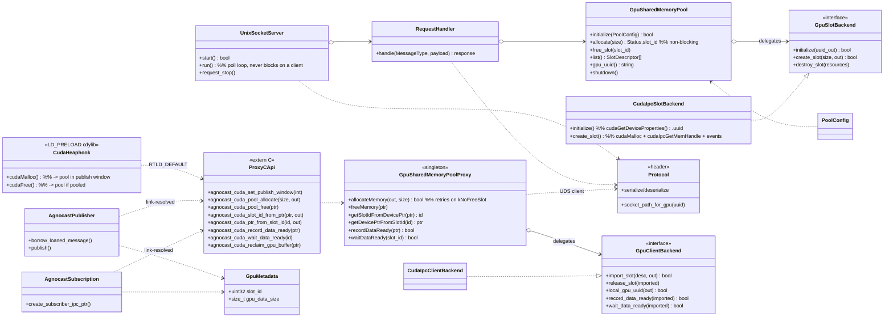
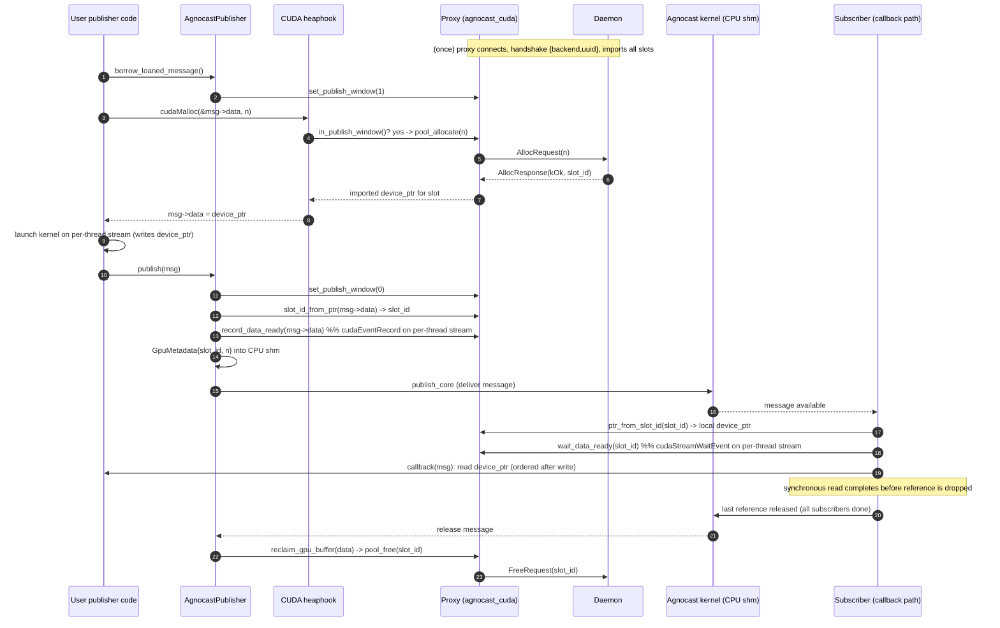
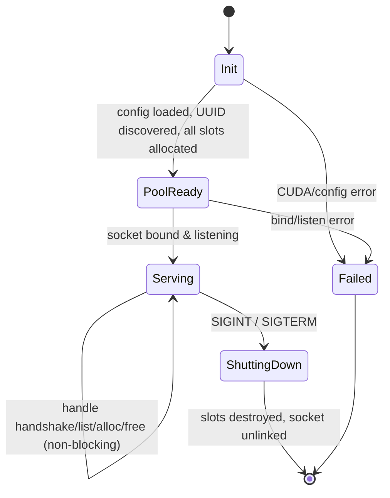

# Agnocast GPU-IPC (CUDA) Design Document

Status: covers work through Step 7 (feature branch `feature/gpu-ipc`).
Scope: zero-copy sharing of **GPU device memory** across processes on one host,
built as an extension of the existing (CPU) Agnocast.

---

## 1. Purpose

Agnocast provides true zero-copy publish/subscribe for ROS 2 by placing message
payloads in shared memory, so subscribers read the exact bytes the publisher
wrote without any copy. That mechanism covers **host (CPU) memory** only.

GPU-accelerated Autoware nodes (camera, LiDAR, perception) keep large buffers in
**CUDA device memory**. Passing such a message between two processes on the same
GPU normally means device→host→device copies or per-message CUDA IPC export,
both of which cost latency and bandwidth on every message.

The GPU-IPC feature extends Agnocast so that a CUDA message's **device buffer**
is also shared zero-copy: the publisher and all subscribers on the same physical
GPU operate on the *same* device allocation, with GPU-side ordering guaranteeing
the subscriber reads only after the publisher's write completes.

The design goal is that a CUDA publisher writes ordinary code
(`cudaMalloc(&msg->data, n)`, launch a kernel, `publish()`), and the framework
transparently routes that allocation into a shared GPU pool.

---

## 2. Relationship to the existing CPU Agnocast

### 2.1 Similarities

| Aspect | CPU Agnocast | GPU-IPC extension |
|---|---|---|
| Zero-copy transport | shared host memory (`/dev/agnocast` + mmap) | shared **device** memory (CUDA IPC) |
| Allocation interception | `libagnocast_heaphook.so` hooks `malloc`/`free` | `libagnocast_cuda_heaphook.so` hooks `cudaMalloc`/`cudaFree` |
| Message lifetime | kernel refcount; freed when all subscribers release | **same** refcount; GPU slot reclaimed on last release |
| API surface | `borrow_loaned_message()` / `publish()` / callback | unchanged — same calls |
| Discovery / delivery | Agnocast kernel module | **reused as-is**; GPU adds only a `slot_id` in the payload |

The CPU path is unchanged and remains the transport for the message struct
itself (headers, and the small `GpuMetadata`). The GPU buffer is shared by an
additional, separate mechanism layered on top.

### 2.2 Differences

- The CPU heaphook can place *any* allocation in shared memory. The GPU buffer,
  by contrast, is served from a **fixed pre-allocated pool** owned by a
  **daemon**, not allocated ad hoc. GPU IPC handle export is expensive and must
  be amortized, and device memory must be bounded.
- A **daemon process** (`gpu_shared_memory_daemon`) must be running; it owns the
  pooled device memory and exports it. CPU Agnocast has no equivalent per-GPU
  daemon.
- The GPU buffer needs **GPU-side ordering** (an interprocess CUDA event), which
  has no analogue in the CPU path.

### 2.3 Restrictions (current)

1. **Same physical GPU.** All participants must be on the GPU the daemon manages
   (matched by UUID). Cross-GPU sharing is refused at handshake.
2. **Pooled sizes only.** A `cudaMalloc` inside the publish window is served from
   the smallest size class that fits. If the pool cannot satisfy it, the hook
   **falls back to a real `cudaMalloc`** — publishing still works but that
   message is *not* zero-copy (and `publish()` aborts if the buffer is not
   pooled, so effectively the pool must be sized for the workload).
3. **Per-thread default stream.** User GPU work must run on the per-thread
   default stream (compile with `nvcc --default-stream per-thread`), because
   Agnocast records/waits its ordering event on that stream.
4. **Publish window only.** Only `cudaMalloc` calls between
   `borrow_loaned_message()` and `publish()` **on the same thread** are pooled.
5. **Subscriber completes reads before release.** The done-boundary is pure CPU
   refcounting; a subscriber must finish its GPU reads before dropping its
   message reference (synchronous copies satisfy this automatically).
6. **Single-threaded / callback-isolated executor** for the subscriber wait
   placement (see §7).

---

## 3. Component / class model

Three build units plus the agnocastlib glue:

- `agnocast_gpu_shared_memory_daemon` — the daemon (owns pooled GPU memory).
- `agnocast_cuda` — the client-side proxy + C ABI (loaded into pub/sub processes).
- `agnocast_cuda_heaphook` — Rust `cdylib`, `LD_PRELOAD`ed, hooks `cudaMalloc`/`cudaFree`.
- `agnocastlib` — CUDA-free core; calls the C ABI, carries `GpuMetadata`.



### 3.1 Responsibilities

**Daemon (`agnocast_gpu_shared_memory_daemon`)**

- `protocol.hpp` — wire format (little-endian, explicit serialization),
  message types (handshake / list / alloc / free), `Status`, `BackendType`,
  variable-length length-prefixed handle blobs (fit CUDA's 64 B and larger NvSci
  handles), and `socket_path_for_gpu(uuid)` (socket path derived from the GPU
  UUID under `/run/agnocast`). Bounds-checked deserializers.
- `socket_io.hpp` — framed message read/write over the Unix socket; shared by
  server and proxy.
- `PoolConfig` / `pool_config_loader` — pool *geometry only* (size classes:
  `slot_size_bytes` × `slot_count`).
- `GpuSlotBackend` (interface) / `CudaIpcSlotBackend` — GPU-specific slot
  creation: `cudaMalloc` the slot, `cudaIpcGetMemHandle`, create the per-slot
  interprocess events and `cudaIpcGetEventHandle`, discover the UUID via
  `cudaGetDeviceProperties().uuid`.
- `GpuSharedMemoryPool` — owns all slots grouped by size class; **non-blocking**
  best-fit `allocate()` (returns `kOk`/`kNoFreeSlot`/`kSizeTooLarge`
  immediately), `free_slot`, `list`, `shutdown`. Delegates GPU work to the backend.
- `RequestHandler` — translates a protocol request into a pool operation and
  builds the response, including the handshake `{backend_type, gpu_uuid}`.
- `UnixSocketServer` — listens, accepts, runs a `poll()` loop, and dispatches.
  **Never blocks on client behaviour.**
- `main.cpp` — args (`--config`, `--socket-path`), load config, init pool, derive
  socket, install SIGINT/SIGTERM handlers, run.

**Client (`agnocast_cuda`)**

- `cudart_loader.hpp` — lazy `dlopen` of `libcudart.so` (no build-time CUDA
  dependency; the package builds on a CUDA-less build farm).
- `GpuClientBackend` / `CudaIpcClientBackend` — import a slot
  (`cudaIpcOpenMemHandle` + `cudaIpcOpenEventHandle`), release it, report the
  local UUID, and record/wait the data-ready event on the per-thread stream.
- `GpuSharedMemoryPoolProxy` — process-wide singleton. On first use it connects
  to the daemon (socket derived from the local UUID), performs the handshake
  (verifying backend type and UUID), and **imports every slot**. Serves
  `allocateMemory` (retries on `kNoFreeSlot` without holding locks),
  `freeMemory`, ptr↔slot_id lookups, and record/wait. Reconnects and re-imports
  on I/O error.
- `proxy_c_api` — the stable `extern "C"` ABI (above) that both the heaphook and
  agnocastlib call. `set_publish_window`/`in_publish_window` use a `thread_local`
  flag.

**Heaphook (`agnocast_cuda_heaphook`, Rust)**

- Interposes `cudaMalloc`/`cudaFree`. Resolves the proxy ABI lazily via
  `dlsym(RTLD_DEFAULT)` (absent ⇒ transparent fallback), and the real CUDA
  functions via `RTLD_NEXT`. `cudaMalloc` is routed to the pool **only** when the
  proxy is present *and* the calling thread is inside the publish window;
  otherwise (and on pool exhaustion) it calls the real `cudaMalloc`.

**agnocastlib glue (CUDA-free)**

- `cuda_pool_api.hpp` — `extern "C"` declarations of the C ABI, resolved at link
  time against `libagnocast_cuda.so`. Keeps agnocastlib free of any CUDA header.
- `gpu_metadata.hpp` — `GpuMetadata { slot_id, gpu_data_size }`, stored in CPU
  shared memory alongside the message.
- `agnocast_publisher.hpp` / `agnocast_callback_info.hpp` — the publish/subscribe
  integration points (see §4).

---

## 4. Publisher / subscriber sequence flow



Key points:

- **Allocation** is transparent to user code: `cudaMalloc` returns a pooled,
  IPC-imported device pointer when inside the window.
- **Ordering** is by a per-slot interprocess `dataReadyEvent`: the publisher
  records it right after the kernel; each subscriber issues
  `cudaStreamWaitEvent` before the callback, so reads are GPU-ordered after the
  write without the publisher ever blocking.
- **Reclaim** is pure CPU work: Agnocast's existing all-subscribers-released
  refcount triggers `reclaim_gpu_buffer`, which returns the slot to the pool. No
  GPU wait on the publisher side (it has no context for the subscribers'
  streams).

---

## 5. Daemon flow and state

### 5.1 Lifecycle sequence

```mermaid
sequenceDiagram
    autonumber
    participant M as main
    participant Pool as GpuSharedMemoryPool
    participant B as CudaIpcSlotBackend
    participant Sv as UnixSocketServer
    participant C as Client (proxy)

    M->>M: parse args, load PoolConfig
    M->>Pool: initialize(config)
    Pool->>B: initialize(uuid_out)  %% cudaGetDeviceProperties().uuid
    loop each size class * count
        Pool->>B: create_slot(size)  %% cudaMalloc + IpcGetMemHandle + events
    end
    M->>Sv: start() (bind socket_path_for_gpu(uuid), chmod, listen)
    M->>Sv: run()  %% poll loop

    C->>Sv: connect + HandshakeRequest
    Sv-->>C: HandshakeResponse{backend, uuid}
    C->>Sv: ListRequest
    Sv-->>C: ListResponse[SlotDescriptor...]
    C->>Sv: AllocRequest(size)
    alt free slot in fitting class
        Sv-->>C: AllocResponse(kOk, slot_id)
    else none free
        Sv-->>C: AllocResponse(kNoFreeSlot)   %% immediate, no blocking
    end
    C->>Sv: FreeRequest(slot_id)
    Sv-->>C: FreeResponse(kOk)

    Note over M,Sv: SIGINT/SIGTERM -> request_stop()
    Sv-->>M: run() returns
    M->>Pool: shutdown (destroy slots; OS reclaims on exit)
```

### 5.2 State transition



The daemon is a single-threaded event loop. Each request is handled to
completion and answered immediately; `alloc` returning `kNoFreeSlot` is a normal
answer, **never a wait** — a slow or buggy client can neither stall the daemon
nor starve other clients.

---

## 6. Design decisions and reasons

1. **Daemon + fixed pool, not per-message IPC export.** CUDA IPC handle
   export/import is costly; a pre-allocated, pre-exported pool amortizes it to
   once per slot and bounds total device memory.

2. **The daemon never blocks on clients; the client retries.** Blocking on the
   daemon side risks blocking *other* client processes indefinitely. `allocate`
   is non-blocking; the proxy sleeps briefly and retries on `kNoFreeSlot`
   *without holding locks*, so other threads can free slots meanwhile.

3. **Config is pool geometry only; the GPU is chosen at launch; the socket path
   is derived from the runtime-discovered UUID.** GPU UUIDs must not be
   hard-coded: while a full-GPU UUID is stable, **MIG instance UUIDs are
   volatile** (they change when instances are reconfigured) and are host- and
   configuration-specific. So the GPU is selected by `CUDA_VISIBLE_DEVICES` at
   launch, the daemon discovers the UUID at runtime, and both daemon and clients
   independently derive the same socket path from it. This guarantees the socket
   always matches the managed GPU with nothing volatile committed to config.

4. **UUID via `cudaGetDeviceProperties().uuid`.** `cudaDeviceGetUuid` is **not a
   CUDA Runtime API symbol** — it belongs to the Driver API (`cuDeviceGetUuid`),
   so it resolves against no `libcudart`. The Runtime API exposes the UUID only
   as the `uuid` field of `cudaDeviceProp`. We read it through a partial,
   ABI-stable view (`uuid` is at offset 256, right after `char name[256]`, across
   CUDA 10/11/12), formatted to the canonical `GPU-xxxxxxxx-...` string that
   matches `nvidia-smi -L`. (Discovered during Step 7 integration; unit tests use
   mock backends and never exercised the real loader.)

5. **Variable-length, length-prefixed handle blobs.** CUDA IPC handles are 64 B,
   but a future NvSci backend uses larger `NvSciBuf`/`NvSciSync` handles. Encoding
   handles as length-prefixed blobs (with bounds checks against the remaining
   buffer) keeps the wire format backend-agnostic.

6. **Delegation, not inheritance, for the backend.** `GpuSharedMemoryPool` and
   `GpuSharedMemoryPoolProxy` each *hold* a backend object (`GpuSlotBackend` /
   `GpuClientBackend`). A different backend (NvSci) can be swapped in without
   touching pool or proxy logic.

7. **No build-time CUDA dependency.** Both the daemon and `agnocast_cuda` load
   `libcudart.so` via `dlopen`/`dlsym` (the `cudart_loader` pattern). This lets
   the packages build as prebuilt `.deb`s on a CUDA-less build farm; the CUDA
   runtime is required only at runtime on the target.

8. **agnocastlib stays CUDA-free.** The publish/subscribe integration calls a
   small `extern "C"` ABI (`cuda_pool_api.hpp`) that is resolved against
   `libagnocast_cuda.so`. The core library never includes a CUDA header, so
   non-CUDA users are unaffected.

9. **Pool only within the publish window.** Only the publisher's message buffer
   should be pooled — not every `cudaMalloc` the process makes. A `thread_local`
   flag set between `borrow_loaned_message()` and `publish()` scopes the routing
   precisely to the buffer that becomes the message.

10. **Events on the per-thread default stream.** Recording/waiting on
    `cudaStreamPerThread` avoids serializing with the legacy default stream and
    other streams. The cost is a restriction: user GPU work must also run on the
    per-thread default stream (`--default-stream per-thread`).

11. **`dataReadyEvent` used; per-slot `dataDoneEvent` unused (done = CPU
    refcount).** A single per-slot event cannot correctly aggregate the GPU-read
    completions of *N independent subscribers across processes*
    (`cudaEventRecord` is last-record-wins). So the done-boundary is Agnocast's
    existing all-subscribers-released **CPU** refcount, and each subscriber is
    responsible for completing its own reads before releasing. Reasons recorded
    with the user:
    - the subscriber usually synchronizes with the GPU anyway to drive its work;
    - Agnocast cannot know which stream the subscriber uses, so it cannot insert
      a correct done-sync on the subscriber's behalf;
    - the publisher has no GPU context when reclaiming — release is pure CPU work.
    The `dataDoneEvent` is kept in the slot for possible future use (e.g. NvSci).

12. **Self-contained reclaim (`reclaim_gpu_buffer`).** agnocastlib cannot call
    `cudaFree`. The C ABI does the right thing itself: pooled pointer → return the
    slot to the pool; otherwise (a fallback real allocation) → real `cudaFree` via
    the runtime loader.

13. **LD_PRELOAD interposes the versioned `cudaMalloc`.** `cudaMalloc` is a
    version-bound undefined reference (`cudaMalloc@libcudart.so.12`); it was
    verified empirically (`LD_BIND_NOW=1 LD_DEBUG=bindings`) that the preloaded
    (unversioned) hook still captures the binding, so interception is reliable.

---

## 7. Known limitations / left for further development

- **Subscriber wait placement.** `cudaStreamWaitEvent` is issued in
  `create_subscriber_ipc_ptr` (the message-take path), which assumes take and
  callback run on the **same thread** — true for the single-threaded /
  callback-isolated executors the sample uses, and required for per-thread-stream
  correctness. A **multi-threaded executor** would need the wait moved to the
  callback-invocation thread.
- **NvSci backend** (Tegra / `NvSciBuf` / `NvSciSync`): the protocol and the
  delegation seams are prepared, but no NvSci backend exists yet.
- **Hook coverage.** Only `cudaMalloc`/`cudaFree` are hooked. Not yet:
  `cudaMallocPitch`, `cudaMallocAsync`, the driver API (`cuMemAlloc`), etc.
- **Proxy reconnection test** and broader failure-injection tests.
- **Packaging.** Release/Debian packaging and heaphook vendoring; staging
  `libagnocast_cuda_heaphook.so` into an install tree so the launch files can
  reference it by soname (the integration test currently uses absolute paths).
- **Socket permissions.** The daemon socket is `0666` for now; tighten (group /
  ACL) for multi-user hosts.
- **MIG.** UUID handling for MIG instances (NVML) is not specifically validated.
- **Pool tuning.** Size classes/counts are a first proposal; a dynamic or
  policy-driven pool and better exhaustion behaviour are open.
- **Multi-GPU / cross-GPU.** Only same-GPU sharing is supported; peer/NVLink
  paths are out of scope so far.
- **CI.** The GPU integration test
  (`agnocast_sample_application/test/cuda_ipc_integration_test.bash`) is not in
  colcon/CI because the build farm has no GPU; a GPU runner would be needed.

---

## 8. How the integration test exercises this (Step 7)

`agnocast_sample_application/test/cuda_ipc_integration_test.bash` starts the
daemon and runs `cuda_talker` (publisher) and `cuda_listener` (subscriber) with
both heaphooks `LD_PRELOAD`ed on a real GPU. The publisher fills each buffer with
`data[i] = (i + seq) % 256`; the subscriber copies the first bytes back and the
test asserts the incrementing pattern (`seq → [seq, seq+1, seq+2, seq+3]`) with
zero mismatches — proving the subscriber read the exact device bytes the
publisher wrote, zero-copy, through the pool + CUDA IPC + interprocess event.
Verified passing on an RTX 4090. Prerequisites: the agnocast kernel module
loaded, both heaphooks built, and a one-time writable `/run/agnocast`.
